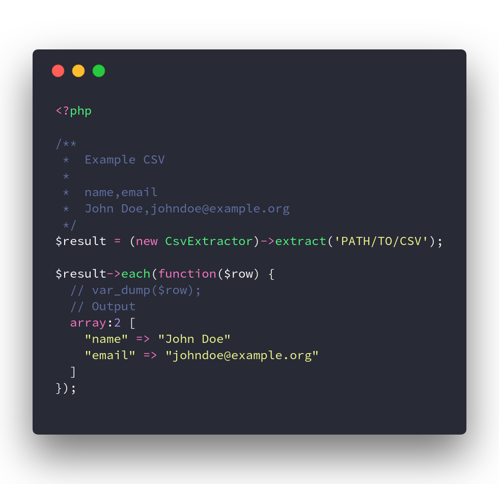

# Bi Extract                                                                 

> Extract data from sources



### Default Extractors
  
#### CSV

```php
<?php

/**
 *  Example CSV
 *
 *  name,email
 *  John Doe,johndoe@example.org
 */ 
$result = (new CsvExtractor)->extract('PATH/TO/CSV');

$result->each(function($row) {
  // var_dump($row);
});
```
