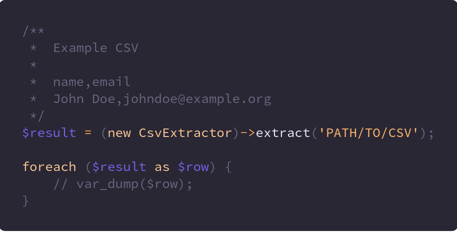

# Bi Extract                                                                 

> Extract data from sources



### Default Extractors
  
#### CSV

```php
<?php

/**
  name,email
  John Doe,johndoe@example.org
**/ 
$result = (new CsvExtractor)->extract('PATH/TO/CSV');

$result->each(function($row) {
  // var_dump($row);
  // Output
  array:2 [
    "name" => "John Doe"    
    "email" => "johndoe@example.org"
  ] 
});
```
